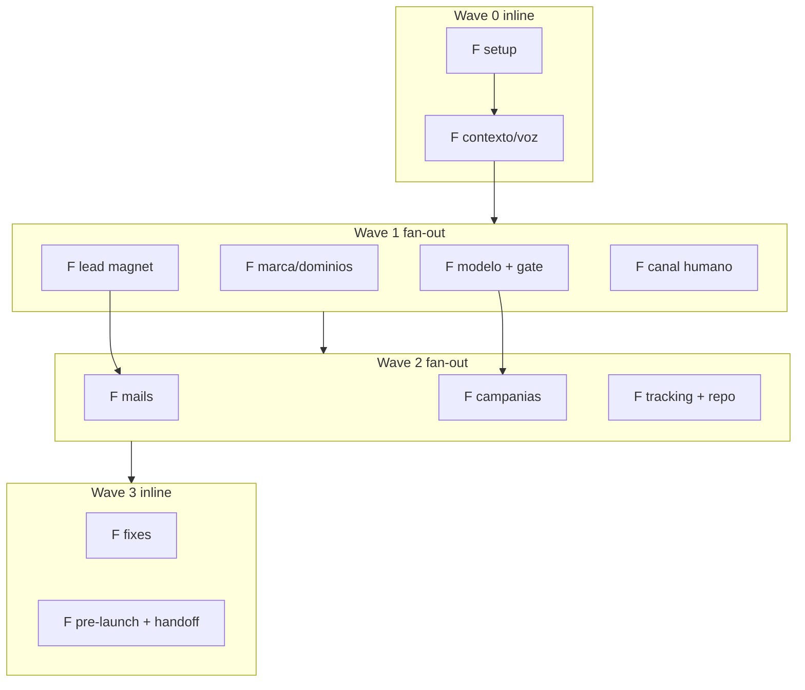

# PRD — Kickoff de ejecución: {{NEGOCIO}}

> **Cuándo usar este template en vez del scaffold simple de `s0-plan-piloto`:** cuando el kickoff no va a ser "una etapa a la vez con tu OK" (el modo default del kit) sino una corrida de **muchos frentes en paralelo** (waves de subagentes, gate de verificación automático, degradación explícita si algo se traba) para dejar todo listo para encender de una sola sentada, típicamente desatendida. Si tu piloto avanza etapa por etapa como manda la regla madre del `SKILL.md`, no hace falta este documento: alcanza con `0.plan.md` + `2.plan-piloto.md` + `3.ejecucion-piloto.md`.
>
> **Copia canónica:** vive en la raíz del proyecto del piloto. El estado vivo por frente durante la ejecución va en un tablero separado (ver §5.1) — no mezcles el plan con el estado corriendo.
>
> **Instrucción de llenado:** completá cada `{{PLACEHOLDER}}` antes de arrancar la corrida. Lo que no sepas todavía NO se inventa: va como ítem en el buffer de datos a validar (§9), nunca como un placeholder rojo suelto en medio de un entregable.
>
> **Ejemplo de referencia:** los corchetes de "Ej." abajo usan el mismo vertical hipotético que `ejemplo/1.research.md` (leadgen para un estudio contable que atiende PyMEs). Es solo para mostrar la forma; tu vertical real puede ser cualquier otro (una clínica, un estudio jurídico, una inmobiliaria).

## 1. Executive summary

{{2-4 líneas: qué piloto es, con quién, qué construye este kickoff (qué falta para encender), qué mecanismo de ejecución usa (fan-out de subagentes por waves, gate de verificación por frente), y la regla de oro: nada se enciende ni publica sin tu OK explícito.}}

## 2. Estado actual (verificado)

> **Regla dura de esta sección:** separá siempre lo que verificaste de primera mano (abriste la fuente, leíste el dato, corriste el chequeo) de lo que estás asumiendo porque alguien lo dijo o porque "tiene sentido". Un PRD que mezcla ambos sin marcarlos es la causa raíz del aprendizaje caro de §2.1.

**Hecho (verificado):** {{qué ya existe y funciona, con la fuente de verificación de cada ítem — no alcanza con "está hecho", hay que poder decir cómo se sabe. Ej.: "landing del estudio contable publicada y trackeando" → fuente: visita directa + Network tab con el pixel disparando.}}

**Novedades desde la última corrida ({{FECHA}}):** {{qué cambió el contexto — accesos nuevos, decisiones tomadas, bloqueos resueltos}}.

**Hallazgos previos que siguen vigentes:** {{qué de corridas anteriores sigue siendo cierto y no hace falta re-derivar}}.

**Asumido (no verificado, entra igual porque no hay mejor dato disponible):** {{lista explícita — cada ítem acá es candidato directo al buffer de datos a validar, §9}}.

### 2.1 — Aprendizaje caro: fuentes de datos externos, siempre verificables y contra-verificadas

Un agente puede reportar como "dato real" algo sacado de una fuente que **no existe** (caso real que motivó esta regla: un agente citó una cuenta de Google Ads con un ID de cuenta inventado, que no estaba en el selector de cuentas real). El daño no es el dato falso en sí mismo, es que **entra a un modelo de presupuesto** y de ahí a una decisión de plata real.

Regla para este kickoff: **todo dato externo (CPC, tamaño de audiencia, costo de una herramienta, cualquier número que un agente "trajo" de una fuente externa, ej.: "el CPC de 'contador PyME' en tu ciudad es de $X") tiene que declarar su fuente de forma verificable** (screenshot, URL exacta, ID de cuenta/recurso que otra persona pueda abrir, timestamp de cuándo se leyó) **y pasar por un agente distinto al que lo generó antes de entrar a un modelo de presupuesto o a un entregable externo.** Un número sin fuente verificable no es un dato, es una alucinación con formato de dato: se marca como `{{ASUMIDO}}` en la sección 2 y no se usa para calcular budget hasta que alguien lo verifique.

## 3. Reglas de negocio (invariantes del piloto)

> Numeradas, porque se citan por número en el resto del documento y en las conversaciones de ejecución. Cada invariante es algo que NINGÚN frente puede violar, sin importar qué tan urgente sea encender.

1. {{Ej.: ventana de tiempo del piloto + criterio de corte mínimo (N leads calificados o M leads, lo que llegue primero). Si el modelo muestra que el corte es inbancable, el frente que lo calcula NO lo cambia solo: lo presenta como decisión para {{DUEÑO_DEL_PILOTO}}.}}
2. {{Ej.: qué queda pospuesto a propósito (pricing, un acuerdo comercial) y no se menciona en ningún material externo hasta que se cierre.}}
3. {{Ej.: reglas de marca — cuántas marcas, cuál es la de respaldo, qué nombre NO se usa.}}
4. {{Ej.: registro/tono del contenido + qué frase o promesa NUNCA se usa (compliance, legal, regulatorio del vertical — un estudio contable no promete "cero auditorías", por ejemplo).}}
5. {{Ej.: cómo se entrega el lead magnet / oferta central (ej.: guía "Checklist de cierre de ejercicio para PyMEs"), con qué mecanismo de opt-in, quién manda la secuencia (nunca a mano).}}
6. {{Ej.: reglas del canal humano (WhatsApp, teléfono, chat) — línea dedicada, guion versionado, qué NO se promete sin acuerdo escrito (SLAs). Marcá si este canal es o no blocker de encendido.}}
7. **Nada de placeholders rojos inline.** Todo dato dudoso, decisión abierta, validación pendiente o mensaje a mandar se centraliza en **el buffer único de datos a validar** (§9). Los entregables salen limpios; ese doc es el único lugar con pendientes.
8. **Kill criteria ANTES de prender**: el gate se define en el frente de modelo/budget y {{DUEÑO_DEL_PILOTO}} lo aprueba; sin eso no se enciende nada.
9. **Nada se enciende ni publica en esta corrida**: campañas en pausa, secuencias sin activar, bots sin número, mails sin enviar. Todo gateado hasta el OK explícito.
10. **Todo se persiste en el proyecto**; estado por frente en el tablero vivo (§5.1).
11. {{Ej.: reglas de destino de los leads — a qué CRM, qué validación server-side, qué campos son obligatorios vs libres.}}
12. {{Ej.: vigencia de datos distribuidos — todo monto/plazo lleva la leyenda de que es orientativo a una fecha, sujeto a revisión (ej. "honorarios estimados, sujetos a evaluación del caso").}}
13. **Sign-off del dueño del negocio como gate de encendido** para material externo. Si un frente solo ajusta algo ya aprobado (saca datos, mejora diseño) sin tocar el fondo, se considera cubierto por el OK anterior; cualquier cambio de fondo vuelve al buffer de §9.

## 4. Inventario de accesos

> La columna "si falla" es la que evita que un frente se trabe en silencio en medio de una corrida desatendida. Si no sabés qué hace un frente cuando el acceso no está, ese frente no está listo para correr solo.

| Recurso | Acceso | Impacto | Si falla |
|---|---|---|---|
| {{Repo de código}} | {{Sí/No/Verificar}} | {{qué frentes dependen}} | {{fallback: cambios vía prompts de la plataforma no-code / se parkea}} |
| {{Cuenta de ads — canal 1, ej. Google}} | {{Sí/No/Verificar}} | {{Keyword Planner + carga de campañas}} | {{fallback: research con rangos marcados como estimación}} |
| {{Cuenta de ads — canal 2, ej. Meta}} | {{Sí/No/Verificar}} | {{audiencias + campañas}} | {{solo spec + playbook, no carga real}} |
| {{Sistema de mail / ESP}} | {{Sí/No/Verificar}} | {{secuencia de nurture}} | {{fallback documentado a otro proveedor}} |
| {{Bot de canal humano / WhatsApp}} | {{Sí/No/Verificar}} | {{activación del canal}} | {{no bloquea encendido si la regla 6 lo permite}} |
| {{Dominios}} | {{Sí/No — normalmente compra humana}} | {{URLs finales}} | {{se generan URLs parametrizadas, ver §10}} |
| {{CRM / base de leads}} | {{Sí/No/Verificar}} | {{destino de todo lead}} | {{sin esto no se prende nada, es blocker duro}} |
| **Crítico del gate de verificación** | {{qué modelos/agentes están disponibles en esta corrida, verificado al arrancar}} | {{si el modelo pedido no está}} | {{regla vigente: el crítico corre con una familia de modelo distinta al ejecutor del frente — sin esto ningún frente cierra}} |

## 5. Orquestación: waves, ejecutor y modelo por frente, HITL, gate de verificación

Orquestador = {{esta sesión / agente designado}}, modo multifrente {{desatendido/semi-atendido}}. Los subagentes escriben SOLO en su subcarpeta asignada y devuelven JSON compacto al orquestador.

### 5.1 — Tablero de estado (separado de este PRD)

Este documento es el plan; el estado corriendo vive en un **tablero vivo separado** (ej. `3.ejecucion-piloto.md` o equivalente) con una tabla `Frente | Wave | Estado | Output | Nota` y un log de la corrida. No mezcles plan con estado: el plan no cambia una vez arrancada la corrida (salvo un hallazgo que lo justifique, documentado), el estado cambia todo el tiempo.

### 5.2 — Gate de verificación por frente

Al cerrar cada frente, el orquestador corre el verificador de tu harness sobre el output (fan-out por claim pesado contra la fuente + un crítico de **familia de modelo distinta al ejecutor**, nunca el mismo modelo que produjo el output — así no se audita a sí mismo). Veredicto:
- ✅ → frente cerrado, status actualizado en el tablero.
- ⚠/❌ → el veredicto vuelve al subagente del frente con instrucción de ajustar. **Máximo {{N, ej. 2}} iteraciones**; si no cierra, se parkea con nota en el buffer de datos a validar (§9) y la corrida sigue (nunca loop infinito).

### 5.3 — Regla de propagación de parkeos (la pieza más valiosa de este método)

Un frente **no se cierra en silencio con un input incompleto.** Si un frente se parkea, todo frente que dependa de él según el mapa de dependencias queda marcado **`degradado`**, nunca ✅. Un frente degradado:
- **se ejecuta igual**, con el mejor input disponible — nunca frena la corrida completa por la falla de un solo frente;
- **declara arriba de su propio entregable** qué input le faltó y qué asumió en su lugar (no lo esconde en un aside, va al principio del documento que produce);
- **entra automáticamente al buffer de datos a validar** (§9) como ítem a rehacer cuando el frente padre se destrabe;
- **nunca pasa a ✅** aunque el gate de verificación le dé el visto: el veredicto máximo de un frente degradado es ⚠.

**Los cuatro estados posibles por frente** (usá exactamente estos, son el vocabulario común de la corrida):

| Símbolo | Estado | Significado |
|---|---|---|
| ✅ | Cerrado | Pasó el gate de verificación con crítico de familia distinta. Sin dependencias parkeadas arriba en la cadena. |
| ⚠ | Degradado | Se ejecutó con input incompleto porque un padre se parkeó (o el propio frente no cerró el gate del todo). Declara qué asumió. Nunca sube a ✅ sin rehacerse con el input completo. |
| ⏸ | Parkeado | No cerró en las iteraciones máximas del gate. Nota abierta en el buffer de datos a validar. |
| ⏳ | Pendiente / corriendo | Todavía no se ejecutó o está en curso. |

### 5.4 — Aprendizaje caro: la relación fuente→artefacto tiene que ser explícita y probada

Un documento markdown puede decir que es "la fuente" de un artefacto generado (un PDF, una imagen, un export) **sin serlo realmente**, y divergir en silencio: alguien edita el `.md`, nadie regenera el PDF, y el PDF que circula ya no coincide con lo que el documento dice que contiene. Nadie lo nota hasta que alguien lo compara a mano (ej.: la guía PDF que baja un lead del estudio contable termina diciendo algo distinto de lo que dice el `.md` que supuestamente la genera).

Regla para este kickoff: cuando un frente produce un artefacto generado a partir de una fuente editable, el entregable del frente tiene que dejar **la relación fuente→artefacto probada, no declarada de palabra**: comando o script exacto que regenera el artefacto desde la fuente, corrido al menos una vez dentro de la misma corrida, con el resultado (path + hash o timestamp) citado en el entregable. Si el frente solo dice "la fuente es X" sin haber corrido la regeneración, ese frente no pasa el gate de verificación — es exactamente el mismo tipo de claim no verificable que el aprendizaje §2.1, aplicado a artefactos en vez de a datos externos.

### 5.5 — Tabla de frentes: ejecutor, modelo, HITL

| Frente | Wave | Ejecutor | Modelo | Human-in-the-loop |
|---|---|---|---|---|
| {{F_setup}} | 0 | orquestador inline | {{modelo del orquestador}} | No (setup mecánico) |
| {{F_voz / F_contexto}} | 0 | orquestador inline | {{modelo del orquestador}} | No (fuente = material existente) |
| {{F_modelo_budget}} | 1 | subagente | {{modelo}} | **Sí: {{DUEÑO_DEL_PILOTO}} aprueba budget + kill criteria** |
| {{F_marca_dominios}} | 1 | subagente | {{modelo}} | **Sí: {{DUEÑO_DEL_PILOTO}} elige nombre + compra dominios** |
| {{F_lead_magnet}} | 1 | subagente + panel hijos | {{modelo}} | {{Soft/Sí, según si hay sign-off previo}} |
| {{F_canal_humano}} | 1 | subagente | {{modelo}} | **Sí: valida guion/copy quien atiende el canal** |
| {{F_mails}} | 2 | subagente + hijo anti-slop | {{modelo}} | **Sí: valida secuencia quien la manda** |
| {{F_campanias}} | 2 | subagente + hijos por canal | {{modelo}} | **Sí: revisa campañas en pausa antes de prender** |
| {{F_tracking_repo}} | 2 | subagente (código) | {{modelo}} | **Sí: decisión de arquitectura de dominios/rutas** |
| {{F_fixes}} | 3 | orquestador inline | {{modelo del orquestador}} | Simple→plataforma no-code; complejo→código directo |
| {{F_prelaunch_handoff}} | 3 | orquestador inline | {{modelo del orquestador}} | **Sí: handoff final con menú, decidís vos si se enciende** |
| Verificador (todos los gates) | — | subagentes | crítico de familia distinta | No (loop automático, máx N vueltas) |

**Camino crítico a primer lead:** {{dominio/URL + campaña principal + tracking E2E + (si aplica) material validado por el dueño del negocio}}. Todo lo demás ({{canal secundario, refinamientos estéticos, nice-to-haves}}) NO bloquea encendido — marcalo explícito acá para que ningún frente se autoconvenza de que es blocker.

## 6. Frentes (spec + acceptance criteria)

> Un AC que no se puede verificar con un chequeo objetivo no es un AC, es una intención. Cada frente necesita al menos un criterio que un agente (o vos) pueda marcar sí/no sin interpretar.

### {{F_id}} — {{Nombre del frente}}
- **Input:** {{qué necesita para arrancar, de qué frente/fuente}}.
- **Trabajo:** {{qué hace, en 2-4 líneas}}.
- **Entregables:** {{archivos/artefactos que produce, con paths}}.
- **AC:** {{criterio verificable 1}}; {{criterio verificable 2}}; {{criterio verificable 3}}.

{{Repetí un bloque por frente. No comprimas todos los frentes en una tabla: los AC necesitan espacio para ser específicos.}}

## 7. Gates y qué NO se hace

- No se enciende campaña, no se envía mail, no se activa bot, no se compra nada sin tu OK explícito.
- No se mergea a main/producción nada que cambie lo visual sin OK; tracking/infra en branch con preview.
- No se escribe ningún dato comercial no acordado (precio, tarifa, plazo) en material externo.
- {{Regla específica del vertical: qué activo existente no se toca.}}
- Todo lo que requiere validación humana va al buffer de §9, nunca frena la corrida por sí solo.

## 8. Tareas humanas (lo que el orquestador NO puede hacer)

> Van en orden de bloqueo: lo primero de esta lista suele ser lo que más tarda en resolverse porque depende de un tercero, así que conviene dispararlo apenas se puede, no al final.

1. {{Ej.: comprar/activar un recurso que solo vos podés pagar (número de teléfono, licencia).}}
2. {{Ej.: decidir un nombre/marca entre las opciones que entrega un frente.}}
3. {{Ej.: comprar dominios del shortlist verificado.}}
4. {{Ej.: crear cuenta en una plataforma que requiere identidad real (ads, pagos).}}
5. {{Ej.: verificar/rotar una credencial o API key.}}
6. {{Ej.: dar acceso a un tercero (CRM compartido, doc compartido).}}
7. {{Ej.: mandar un entregable a validar a quien tiene el sign-off (dueño del negocio, socio).}}
8. {{Ej.: aprobar budget + kill criteria (output del frente de modelo).}}
9. {{Ej.: revisar campañas cargadas en pausa antes de prender.}}
10. {{Otras tareas personales/administrativas colaterales que salieron en el camino, si las hay.}}

## 9. Buffer único de datos a validar

> **Un solo lugar para todo pendiente.** Nunca un placeholder rojo suelto dentro de un entregable — si algo no está confirmado, no se inventa ni se dispersa: entra acá con quién lo resuelve y qué lo destraba. Vive en un archivo propio del proyecto (ej. `datos-a-validar.md`), este PRD solo apunta a él.

| # | Ítem | Origen (qué frente lo generó) | Quién lo resuelve | Qué lo destraba |
|---|---|---|---|---|
| 1 | {{dato/decisión pendiente}} | {{frente}} | {{DUEÑO_DEL_PILOTO / socio / cliente}} | {{qué hace falta para cerrarlo}} |

## 10. Camino crítico y URLs parametrizadas (anti-deadlock)

Todo lo que depende de un recurso que compra un humano (dominio, número, cuenta) se genera con placeholders paramétricos (ej. `{{DOMINIO_PRINCIPAL}}`, `{{DOMINIO_VERTICAL_A}}`) en vez de bloquear la escritura del entregable hasta que el recurso exista. Un script o comando único de regeneración post-compra reemplaza los placeholders en todos los archivos afectados de una sola pasada — referenciado en el runbook de encendido y en la lista de tareas humanas (§8). Esto es lo que evita que varios frentes se frenen esperando que compres un dominio: escriben con el placeholder y se regeneran después.

## 11. Documentación continua

Al cierre de cada wave el orquestador actualiza el tablero vivo (§5.1); al cierre total corre tu flujo de cierre/documentación habitual (estado, log de decisiones, memoria si tu sistema la usa). Cualquier sistema externo compartido (CRM, base de gestión de tareas) se toca en el frente de setup y al final (link al plan desde la tarea madre).
